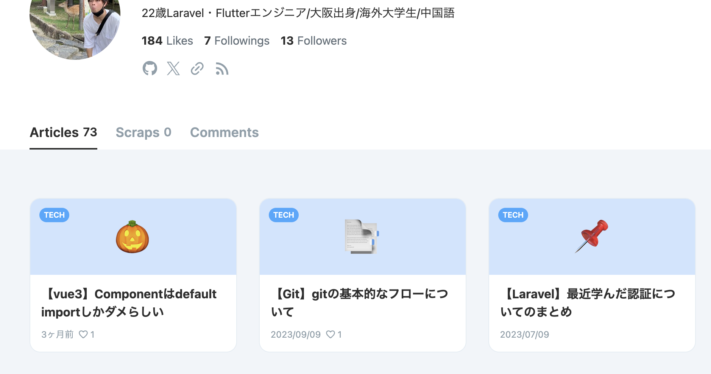
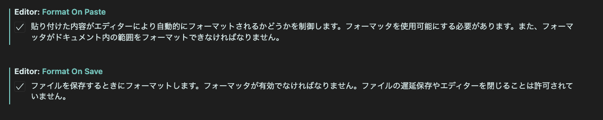

# I'm studying front-end in myself

## 目的

- フロントエンドの基礎(特に css/js)を身につける
- ブログの内容としてはエンジニアリングロードマップの様な形で、好きに本文を書ける様にしたい

## デザイン

Zenn のような構成で

IO のようなデザインで

**ブログの様なサイトを作る**

- 第一回 Git/第二回コード整形/みたいに続けたいので後々はサーバサイドもつけて CRUD をできる様にする
- DB 構成としてはまず posts テーブルだけ、今後は user をつけたいがまあ後でいいわ

## 拡張機能

### フロント/&フォーマット系

- Eslint
  [参考記事](https://qiita.com/mzmz__02/items/63f2624e00c02be2f942)があったのであとで追記

- Pritter(コード自動整形)
  VScode 　 → 「Command + ,」で設定を開ける。

  1. Format On Save と　 Format on Paste にチェックを入れる
  2. default formatter から html/css/js... といったものにチェックをつけないと有効にならない

  
  

- indent-rainbow(インデントの色)
  インデントのタブサイズを 2 にすることで赤くなくなる
  ```setting.json
    "indentRainbow.colors": [
      "rgba(255,255,64,0.07)",
      "rgba(127,255,127,0.07)",
      "rgba(255,127,255,0.07)",
      "rgba(79,236,236,0.07)"
    ],
    "indentRainbow.excludedLanguages": []
  ```
  indentRainbow.colors を設定することでインデントカラーを変更したり、
  indentRainbow.excludedLanguages を設定しテキストファイル(json)なども、拡張機能の設定内にできるらしい。（json だけキモいな〜とかあればここの設定見直そう）

### Git 系

- Gitlens
